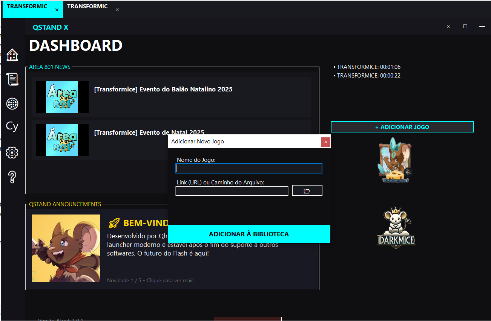
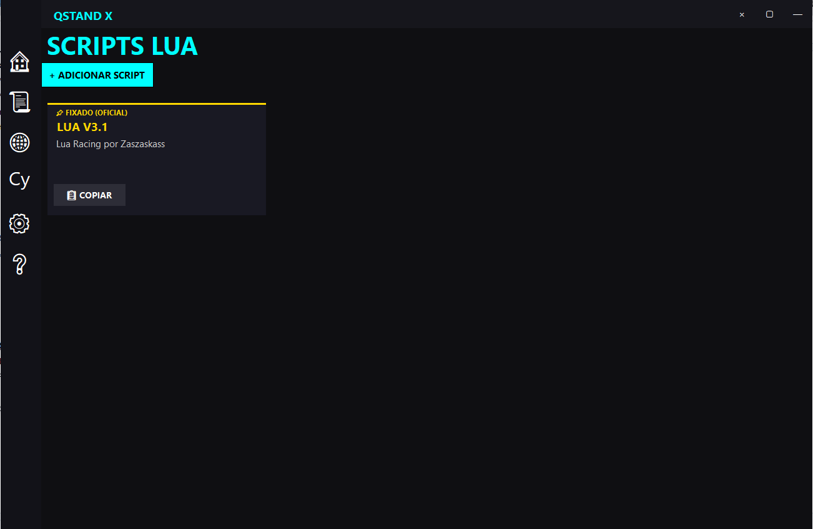

# 🌌 QstandX 2026

  
  
  

  

---

**QstandX 2026** é um launcher de alto desempenho para jogos Flash, desenvolvido em 2026 como a alternativa definitiva após a falta de suporte de ferramentas clássicas como **iMouse** e **Baffler**. Focado em velocidade, automação e customização para a comunidade.

---
---

## 🛠️ Próxima Atualização: v1.1.0 (Coming Soon)

O **QstandX** está evoluindo de um launcher para um ecossistema social. Confira o progresso das novas funcionalidades:

### 🛡️ Sistema de Clãs & Ranking
Criação de guildas, XP coletivo e disputa pelo topo do Ranking Global.
`████████░░ 80%`

### 💰 Economia (Loja de Ouro & Diamantes)
Ganhe recursos completando missões e troque por medalhas e cosméticos exclusivos na Q-Store.
`██████░░░░ 60%`

### 💬 Global & Clan Chat
Integração de chat em tempo real para comunicação direta entre membros e aliados.
`████░░░░░░ 40%`

> [!TIP]
> **Quer ser um Beta Tester?** Os membros ativos no nosso Discord terão acesso antecipado às funções de Clã para garantir os nomes de suas guildas antes do lançamento oficial.

---

## 🚀 Diferenciais (Features)

* ⚡ **Turbo Mode:** Prioridade de processo em tempo real para evitar quedas de FPS.
* 🧠 **Auto-RAM Optimization:** Limpeza agressiva e automática de cache e memória de trabalho.
* 📚 **Biblioteca Customizada:** Adicione seus próprios arquivos `.swf` ou links de jogos favoritos.
* 📜 **Engine de Scripts:** Gerenciador de scripts Lua integrado.
* 🖥️ **Interface Moderna:** UI translúcida com modo Auto-Hide e suporte nativo a Fullscreen (F11).
* 🛰️ **News Feed:** Integração direta com as notícias do **Area 801**.
* 🔄 **Auto-Update:** Sistema inteligente que detecta novas versões e atualiza o launcher automaticamente.

---

## 📸 Screenshots

> 
> 
> 

---

## 🛠️ Como Instalar

1. Clique no botão **[BAIXAR QSTANDX]** no topo desta página.
2. Extraia o arquivo `QstandX.zip` em uma pasta de sua preferência.
3. Certifique-se de que o `flashplayer.exe` (ou o motor de sua preferência) está na pasta `engines` ou na raiz.
4. Execute o `QstandX.exe`.
5. O launcher criará automaticamente um atalho na sua Área de Trabalho após a primeira atualização.

---

## ⌨️ Atalhos Úteis

| Tecla | Ação |
| :--- | :--- |
| **F11** | Alternar Tela Cheia (Fullscreen) |
| **CTRL + Mouse** | Arrastar a janela do jogo livremente |
| **Botão Direito (Aba)** | Recarregar jogo ou resetar posição |

---

## ☕ Apoie o Projeto

Se o **QstandX** melhorou sua jogabilidade, considere apoiar o desenvolvimento contínuo. Sua doação ajuda a manter os servidores de update e o suporte a novas engines!

  

*As doações são processadas via PayPal de forma segura e privada.*

---

## 🤝 Créditos e Motivação

Este projeto foi desenvolvido por **Qhnk** em 2026.
A motivação principal foi suprir a carência de launchers otimizados para jogos Flash que pararam de funcionar ou ficaram obsoletos. 

O QstandX é feito por jogadores, para jogadores.

---

## 📬 Contato & Suporte

* **Github:** [@qhnk](https://github.com/qhnk)
* **Discord:** [ENTRE NO MEU SERVIDOR](https://discord.gg/9E4Sdrp77W)

---
*Este software é fornecido "como está", sem garantias explícitas.*