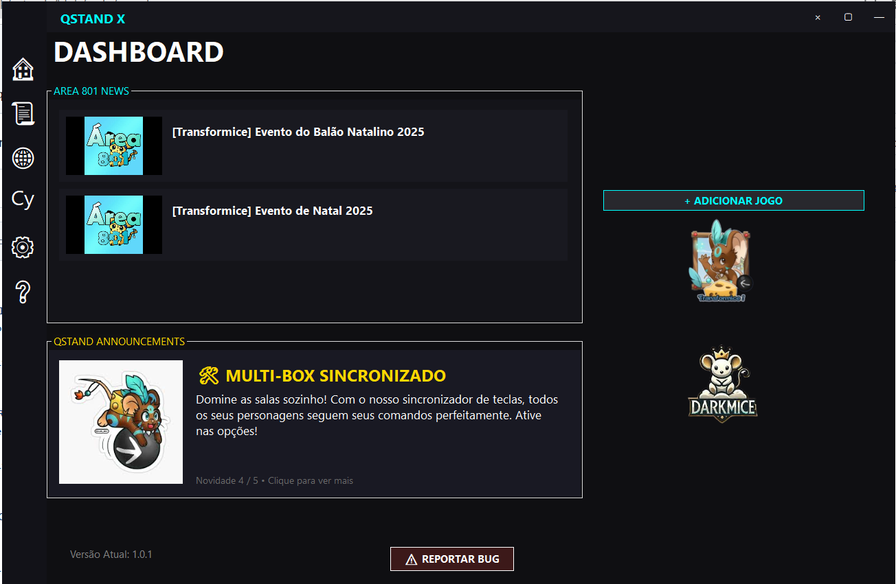

# 🌌 QstandX 2025

**QstandX 2025** é um launcher de alto desempenho para jogos Flash, desenvolvido em 2025 como a alternativa definitiva após a falta de suporte de ferramentas clássicas como **iMouse** e **Baffler**. Focado em velocidade, automação e customização para a comunidade.

---

## 🚀 Diferenciais (Features)

*   ⚡ **Turbo Mode:** Prioridade de processo em tempo real para evitar quedas de FPS.
*   🧠 **Auto-RAM Optimization:** Limpeza agressiva e automática de cache e memória de trabalho.
*   📚 **Biblioteca Customizada:** Adicione seus próprios arquivos `.swf` ou links de jogos favoritos.
*   📜 **Engine de Scripts:** Gerenciador de scripts integrado para automatizar tarefas.
*   🖥️ **Interface Moderna:** UI translúcida com modo Auto-Hide e suporte nativo a Fullscreen (F11).
*   🛰️ **News Feed:** Integração direta com as notícias do **Area 801**.

---

## 📸 Screenshots

> 

---

## 🛠️ Como Instalar

1. Vá até a aba [Releases](https://github.com/qhnk/SEU_REPOSITORIO/releases/latest).
2. Baixe o arquivo `QstandX.zip`.
3. Extraia em uma pasta de sua preferência.
4. Certifique-se de que o `flashplayer.exe` está na mesma pasta.
5. Execute o `QstandX.exe`.

---

## ⌨️ Atalhos Úteis

| Tecla | Ação |
| :--- | :--- |
| **F11** | Alternar Tela Cheia (Fullscreen) |
| **CTRL + Mouse** | Arrastar a janela do jogo livremente |
| **Botão Direito (Aba)** | Recarregar jogo ou resetar posição |

---

## 🤝 Créditos e Motivação

Este projeto foi desenvolvido por **Qhnk** em 2025.
A motivação principal foi suprir a carência de launchers otimizados para jogos Flash que pararam de funcionar ou ficaram obsoletos. 

O QstandX é feito por jogadores, para jogadores.

---

## 📬 Contato & Suporte

*   **Github:** [@qhnk](https://github.com/qhnk)
*   **Discord:** [ENTRE NO MEU SERVIDOR]([SEU_LINK_AQUI](https://discord.gg/9E4Sdrp77W))

---
*Este software é fornecido "como está", sem garantias explícitas.*
